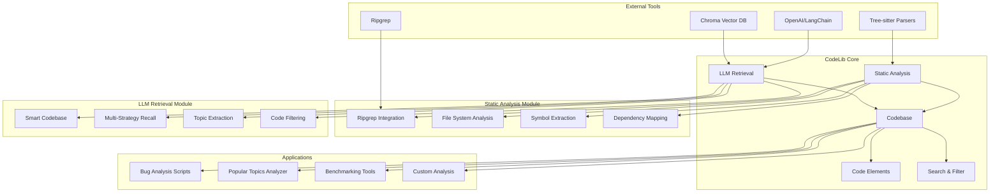
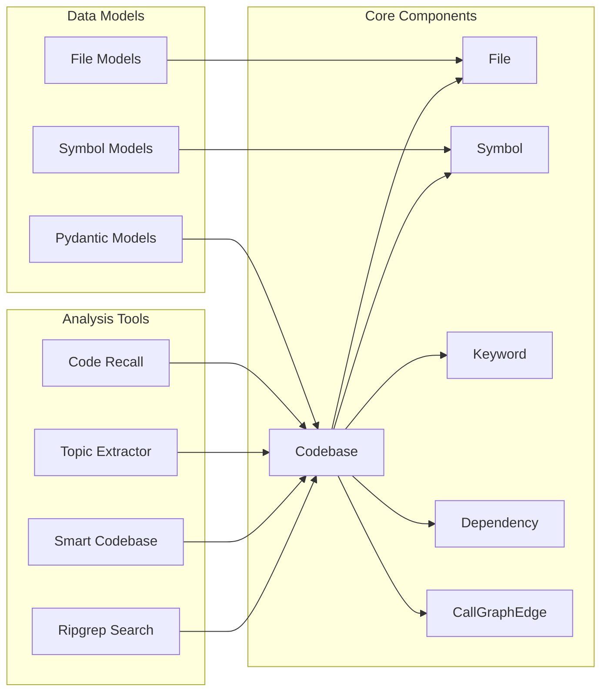

# CodeLib - Code Analysis Library

> A comprehensive Python library for static code analysis and LLM-powered code retrieval, developed by XuanWu Lab / TSpark Security.

## 🎯 Overview

CodeLib is a powerful toolkit that combines traditional static analysis with modern LLM-powered code understanding capabilities. It provides a unified interface for analyzing codebases, extracting insights, and performing intelligent code retrieval tasks.

### Key Features

- **Static Analysis**: Comprehensive codebase representation and analysis tools
- **LLM Integration**: Advanced code retrieval and analysis using Large Language Models
- **Flexible Architecture**: Modular design supporting various analysis strategies
- **Rich Tooling**: Command-line utilities and benchmarking tools
- **Extensible**: Plugin-based architecture for custom analysis workflows

## 🏗️ Architecture


```mermaid
graph TB
    subgraph "CodeLib Core"
        A[Static Analysis] --> C[Codebase]
        B[LLM Retrieval] --> C
        C --> D[Code Elements]
        C --> E[Search & Filter]
    end
    
    subgraph "Static Analysis Module"
        A --> F[Ripgrep Integration]
        A --> G[File System Analysis]
        A --> H[Symbol Extraction]
        A --> I[Dependency Mapping]
    end
    
    subgraph "LLM Retrieval Module"
        B --> J[Smart Codebase]
        B --> K[Multi-Strategy Recall]
        B --> L[Topic Extraction]
        B --> M[Code Filtering]
    end
    
    subgraph "External Tools"
        N[Tree-sitter Parsers] --> A
        O[OpenAI/LangChain] --> B
        P[Chroma Vector DB] --> B
        Q[Ripgrep] --> F
    end
    
    subgraph "Applications"
        R[Bug Analysis Scripts]
        S[Popular Topics Analyzer]
        T[Benchmarking Tools]
        U[Custom Analysis]
    end
    
    C --> R
    C --> S
    C --> T
    C --> U
```

### Component Overview


```mermaid
graph LR
    subgraph "Core Components"
        A[Codebase] --> B[File]
        A --> C[Symbol]
        A --> D[Keyword]
        A --> E[Dependency]
        A --> F[CallGraphEdge]
    end
    
    subgraph "Analysis Tools"
        G[Ripgrep Search] --> A
        H[Smart Codebase] --> A
        I[Topic Extractor] --> A
        J[Code Recall] --> A
    end
    
    subgraph "Data Models"
        K[Pydantic Models] --> A
        L[File Models] --> B
        M[Symbol Models] --> C
    end
```

## 🚀 Quick Start

### Prerequisites

- Python 3.12 or higher
- Git (for repository analysis)
- Optional: OpenAI API key (for LLM features)

### Installation

1. **Clone the repository:**
   ```bash
   git clone &lt;repository-url&gt;
   cd codelib
   ```

2. **Install using uv (recommended):**
   ```bash
   # Install uv if you haven't already
   pip install uv
   
   # Install the package
   uv sync
   ```

3. **Alternative: Install using pip:**
   ```bash
   pip install -e .
   ```

### Install with Optional Dependencies

```bash
# For statistics features
uv sync --extra stats

# For built-in LLM implementations
uv sync --extra builtin-impl

# For CLI tools
uv sync --extra cli

# Install all extras for development
uv sync --all-extras
```

### Environment Setup

Create a `.env` file in the project root for LLM features:

```bash
# OpenAI Configuration
OPENAI_API_KEY=your_openai_api_key_here
OPENAI_MODEL=gpt-4

# Optional: Custom API endpoints
OPENAI_API_BASE=https://api.openai.com/v1
```

## 📖 Usage Examples

### Basic Static Analysis

```python
from codelib import Codebase

# Load a codebase
codebase = Codebase.from_path("/path/to/your/project")

# Get basic statistics
print(f"Total files: {len(codebase.files)}")
print(f"Total symbols: {len(codebase.symbols)}")

# Find files by pattern
python_files = codebase.find_files(pattern="*.py")

# Search for specific code patterns
matches = codebase.search("function.*async")
```

### LLM-Powered Code Retrieval

```python
from codelib.retrieval import SmartCodebase

# Initialize smart codebase with LLM capabilities
smart_codebase = SmartCodebase.from_path("/path/to/project")

# Perform intelligent code search
results = smart_codebase.search(
    query="functions that handle user authentication",
    strategy="semantic"
)

# Extract topics from codebase
topics = smart_codebase.extract_topics(limit=10)
```

### Advanced Analysis

```python
from codelib.static import ripgrep_search
from codelib.retrieval import multi_strategy_code_mapping

# Combine static and LLM analysis
static_results = ripgrep_search(
    path="/path/to/project",
    pattern="class.*Exception",
    file_types=["*.py"]
)

# Apply LLM filtering
filtered_results = multi_strategy_code_mapping(
    results=static_results,
    query="custom exception classes for API errors"
)
```

## 🛠️ Available Scripts

The `scripts/` directory contains several analysis tools:

### Bug Analysis
```bash
python scripts/analyze_bug_reports.py --help
```
Analyzes bug reports and identifies patterns in codebases.

### Popular Topics Analyzer
```bash
python scripts/popular_topics_analyzer.py --help
```
Identifies trending topics and patterns across multiple repositories.

### Bug Finder
```bash
python scripts/bug_finder.py --help
```
Automated bug detection using static analysis and LLM insights.

### Benchmarking
```bash
python scripts/benchmark.py --help
```
Performance benchmarking for analysis operations.

## 📊 Benchmarking

The project includes comprehensive benchmarking tools:

```bash
# Run benchmarks
cd bench/
python -m pytest

# View benchmark repositories
cat bench/repos.txt
```

## 🔧 Development Setup

### Development Installation

```bash
# Clone and setup for development
git clone &lt;repository-url&gt;
cd codelib

# Install with development dependencies
uv sync --all-extras

# Install pre-commit hooks (optional)
pre-commit install
```

### Running Tests

```bash
# Run all tests
pytest

# Run with coverage
pytest --cov=codelib

# Run specific test modules
pytest test/test_static.py
```

### Project Structure

```
codelib/
├── codelib/               # Main library code
│   ├── static/           # Static analysis tools
│   │   ├── codebase/    # Codebase representation
│   │   └── ripgrep/     # Ripgrep integration
│   ├── retrieval/       # LLM-powered retrieval
│   │   ├── code_recall.py
│   │   ├── smart_codebase.py
│   │   └── topic_extractor.py
│   ├── utils/           # Utility functions
│   └── impl/            # Implementation modules
├── scripts/             # Analysis scripts
├── bench/              # Benchmarking tools
├── test/               # Test suite
└── docs/               # Documentation
```

## 🎛️ Configuration

### Environment Variables

| Variable | Description | Default |
|----------|-------------|---------|
| `OPENAI_API_KEY` | OpenAI API key for LLM features | Required for LLM |
| `OPENAI_MODEL` | OpenAI model to use | `gpt-4` |
| `OPENAI_API_BASE` | Custom OpenAI API endpoint | `https://api.openai.com/v1` |
| `CODELIB_CACHE_DIR` | Cache directory for analysis results | `~/.cache/codelib` |

### Configuration File

Create a `codelib.toml` file in your project root:

```toml
[codelib]
# Default analysis settings
max_file_size = 1048576  # 1MB
ignore_patterns = [".git", "__pycache__", "node_modules"]

[codelib.llm]
# LLM configuration
model = "gpt-4"
temperature = 0.1
max_tokens = 2048

[codelib.static]
# Static analysis settings
use_tree_sitter = true
extract_comments = true
```

## 🚀 Advanced Features

### Custom Analysis Workflows

```python
from codelib.static import Codebase
from codelib.retrieval import RecallStrategy

# Define custom analysis workflow
class SecurityAnalysisWorkflow:
    def __init__(self, codebase_path):
        self.codebase = Codebase.from_path(codebase_path)
        
    def find_security_issues(self):
        # Combine multiple analysis strategies
        patterns = [
            "eval\\(",      # Dangerous eval usage
            "exec\\(",      # Dangerous exec usage
            "os\\.system",  # System command execution
            "subprocess",   # Subprocess usage
        ]
        
        issues = []
        for pattern in patterns:
            matches = self.codebase.search(pattern)
            issues.extend(matches)
            
        return issues
```

### Plugin System

```python
from codelib.static import CodebasePlugin

class CustomAnalysisPlugin(CodebasePlugin):
    def analyze(self, codebase):
        # Custom analysis logic
        return {"metrics": self.calculate_metrics(codebase)}
    
    def calculate_metrics(self, codebase):
        # Implementation
        pass

# Register plugin
codebase.register_plugin(CustomAnalysisPlugin())
```

## 📚 API Reference

### Core Classes

#### `Codebase`
Main class for codebase representation and analysis.

**Methods:**
- `from_path(path)`: Load codebase from filesystem path
- `search(pattern)`: Search for code patterns
- `find_files(pattern)`: Find files matching pattern
- `get_symbols()`: Extract all symbols
- `get_dependencies()`: Get dependency graph

#### `SmartCodebase`
LLM-enhanced codebase analysis.

**Methods:**
- `search(query, strategy)`: Intelligent code search
- `extract_topics(limit)`: Extract main topics
- `filter_by_relevance(query)`: Filter results by relevance

### Analysis Functions

#### Static Analysis
- `ripgrep_search(path, pattern, **kwargs)`: Fast text search
- `ripgrep_glob(path, pattern)`: File globbing
- `ripgrep_search_symbols(path, symbol_type)`: Symbol search

#### LLM Retrieval
- `multi_strategy_code_mapping(results, query)`: Multi-strategy analysis
- `multi_strategy_code_filter(results, query)`: Smart filtering

## 🤝 Contributing

1. Fork the repository
2. Create a feature branch: `git checkout -b feature/amazing-feature`
3. Make your changes and add tests
4. Ensure all tests pass: `pytest`
5. Commit your changes: `git commit -m 'Add amazing feature'`
6. Push to the branch: `git push origin feature/amazing-feature`
7. Open a Pull Request

### Code Style

- Follow PEP 8 style guidelines
- Use type hints for all functions
- Add docstrings for public APIs
- Maintain test coverage above 80%

## 📄 License

This project is licensed under the MIT License - see the LICENSE file for details.

## 🆘 Support

- **Issues**: Report bugs and request features via GitHub Issues
- **Documentation**: Check the `docs/` directory for detailed guides
- **Community**: Join our discussions in GitHub Discussions

## 🔄 Changelog

### v0.1.16 (Current)
- Enhanced LLM integration with multiple provider support
- Improved static analysis performance
- Added comprehensive benchmarking suite
- Better error handling and logging

### v0.1.15
- Initial multi-strategy code retrieval
- Tree-sitter parser integration
- Basic LLM-powered analysis tools

## 🏆 Acknowledgments

- **XuanWu Lab** - Original development and research
- **TSpark Security** - Security analysis expertise
- **Contributors** - All developers who have contributed to this project

---

*Made with ❤️ by the XuanWu Lab / TSpark Security team*
