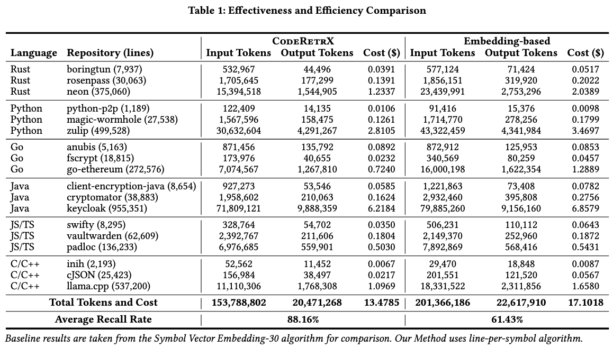

# CodeRetrX: Code Analysis and Semantic Retrieval Library with Smart Strategies 

An AI-powered code analysis library that combines **static analysis** with **LLM-based code retrieval strategies** to perform intelligent code search.

## 🏗️ System Architecture

CodeRetrX processes repositories through a multi-stage pipeline: **Static Analysis** → **Code Retrieval** (**Coarse Recall** → **Refined Recall**)

### 📝 Static Analysis 

Static analysis extracts metadata, including file structures, dependencies, symbols (e.g., classes, functions), and other relevant details. The results of static analysis serve as the foundation for code retrieval and can also be utilized independently for tasks like repository exploration and visualization.

#### Core processes

- **Code Parsing**: Uses tree-sitter to parse source code into abstract syntax trees across 9 programming languages
- **Symbol Extraction**: Extracts functions, classes with hierarchical relationships and dependency
- **Content Structuring**: Breaks code into semantic chunks (definitions, references, imports) with keyword extraction
- **Search Infrastructure**: Integrates ripgrep for fast pattern matching and prepares data for vector similarity search

### 🎯 Code Retrieval 

The code retrieval process operates in two stages recalling: prioritizes high recall in the coarse stage (retrieving as many relevant code snippets as possible at minimal cost) and high precision in the refined stage (eliminating false positives), ensuring effective code analysis and security research.

#### Coarse Recall Stage

The coarse recall focuses on maximizing recall while keeping costs low, aiming to retrieve as many potentially relevant code snippets as possible. This stage prioritizes recall over precision, allowing for false positives to ensure comprehensive coverage. Techniques such as vector-based retrieval, LLM-driven semantic analysis, and adaptive algorithms are employed to achieve efficient, large-scale filtering. The `line_per_symbol` method, used in our paper, is our best-performing approach and is chosen for optimal performance.

For detailed information about available strategies and their performance characteristics, see [STRATEGIES.md](STRATEGIES.md). See our [experimental results](#-experiments) for performance benchmarks.

#### Refined Recall Stage

The refined recall targets precision by removing the false positives introduced in the coarse stage. It applies a high-precision, strict-validation strategy to isolate truly relevant code snippets. This is achieved through advanced LLM-based semantic analysis with stricter filtering criteria, combined with optional secondary validation using enhanced models to re-evaluate and refine the results from the coarse stage.

## 🚀 Setup & Installation

### Prerequisites

- **uv** package manager ([Install uv](https://docs.astral.sh/uv/getting-started/installation/)), with python 3.12+
- **LLM provider API keys** (OpenAI, Anthropic, etc.)
- **Vector embedding model keys** (for similarity search)

### Local Development Setup

1. **Clone the repository:**

   ```bash
   git clone https://github.com/XuanwuAI/CodeRetrX.git
   cd coderetrx
   ```

2. **Install Python dependencies:**

   ```bash
   uv sync --all-extras
   ```

3. **Configure environment:**

   ```bash
   EMBEDDING_BASE_URL=https://your-embedding-service.com
   EMBEDDING_API_KEY=your_embedding_api_key_here
   OPENAI_BASE_URL=https://your-key-service.com/
   OPENAI_API_KEY=your_openai_api_key_here
   ```

## 🖥️ Usage

```python
from pathlib import Path
from coderetrx.retrieval import coderetrx_filter, CodebaseFactory

# Initialize codebase
codebase = CodebaseFactory.new("repo_name", Path("/path/to/your/repo"))

# Search for relevant code
elements, llm_results = await coderetrx_filter(
    codebase=codebase,
    prompt="your_filter_prompt",
    subdirs_or_files=["src/"],
    target_type="symbol_content",
    coarse_recall_strategy="line_per_symbol"
)

# Process results
for element in elements:
    print(f"Found: {element.name} in {element.file.path}")
```

For detailed usage examples and advanced configurations, see [USAGE.md](USAGE.md).

### Quick Start

A simple usage example:

```bash
uv run -m scripts.code_retriever
```

Analyze and compare results from different strategies:

```bash
uv run -m scripts.analyze_code_reports
```

This tool provides comprehensive evaluation capabilities, including **coverage analysis** to compare how many issues each strategy finds against the ground truth, **cost comparison** to assess token usage and LLM costs across strategies, and **performance metrics** to analyse the overall effectiveness of different approaches.

## 🧪 Experiments

We conducted comprehensive experiments on large-scale benchmarks across multiple programming languages and repository sizes to validate the effectiveness of our code retrieval strategies. Our benchmarking shows that the `line_per_symbol` strategy achieves over 90% recall with approximately 25% of the computational cost.




For detailed experiment setup, methodology, and results, see [bench/EXPERIMENTS.md](bench/EXPERIMENTS.md).


## 📚 Extras

- `stats`: for codebase statistics
- `builtin-impl`: for builtin LLM code retrieval tools
- `cli`: for command-line interface tools

e.g. specify `coderetrx[builtin-impl]` in `pyproject.toml` to have builtin LLM code retrieval tools.