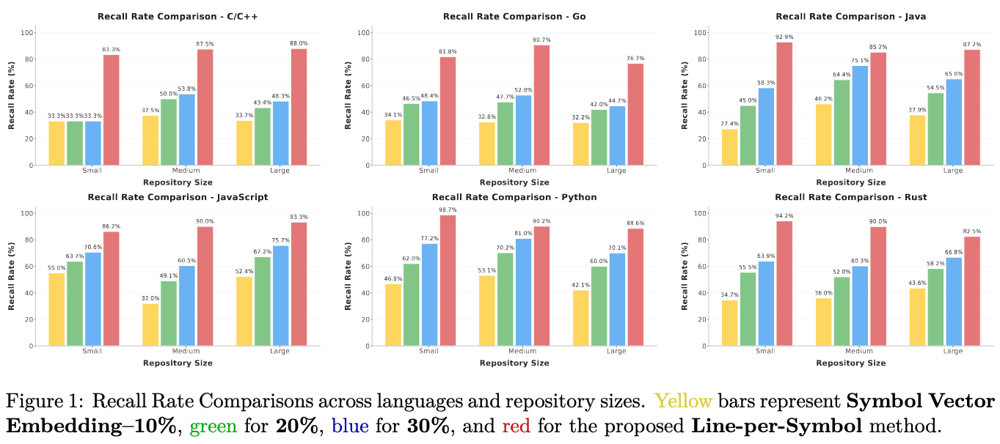
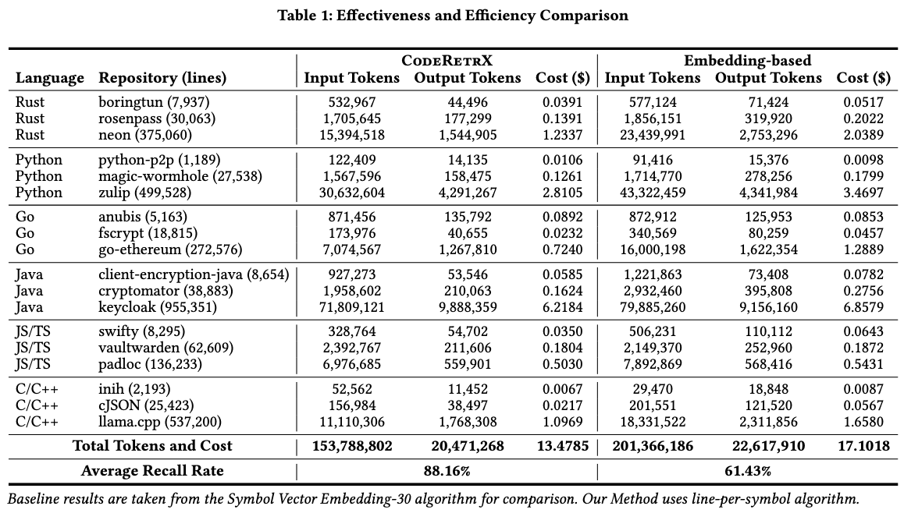

# Experiments

We conducted comprehensive experiments on large-scale benchmarks across multiple programming languages and repository sizes to validate the effectiveness of our code retrieval strategies. The analysis demonstrates how **`coderetrx_filter`** performs across various bug types and complexity levels.

## Experiment Setup

All methods share the same indexing and parsing pipeline (repository snapshot, language parser, and symbol table extraction). The Symbol Vector Embedding baseline encodes identifier-level semantics only, while Line-per-Symbol indexes each line within a function / class's body, enabling precise structure-aware retrieval. We used **gpt-oss-120b** for dataset construction and evaluation.

## Performance Benchmarks

The following results demonstrate the performance across different strategies. Figure 1 shows the Recall Rate Comparisons across languages and repository sizes and Table 1 compares the Effectiveness and Efficiency between CodeRetrX and baselines.

